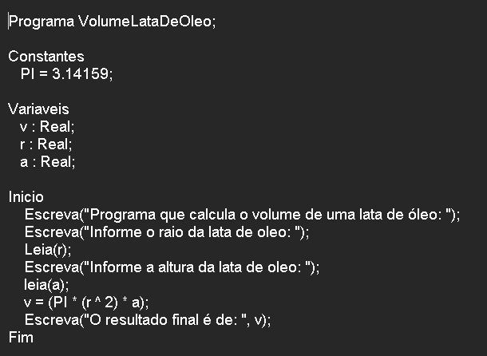

# VolumeDeUmaLataDeOleoEmLPP

**Volume de Uma Lata de Oleo Em LPP - Português Estruturado - Portugol - Potigol - Metalinguagem - Pseudocódigo - Pseudolinguagem**

   

Autor: Erick Leite Freire 
Criado em: 23-01-2024 
Site: [Escola do Autodidata](https://www.escoladoautodidata.com.br) 
